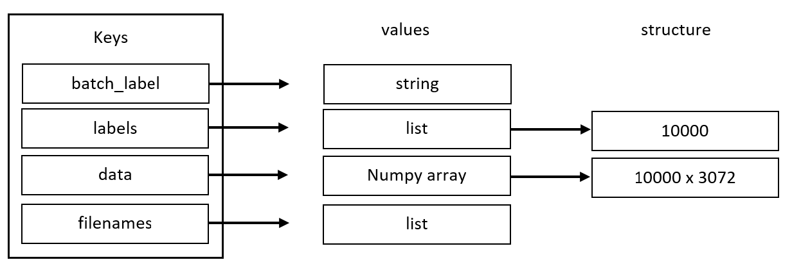

# ML-Image-Classification
## About Data
Here I am using CIFAR10 dataset to train the model, and I got it from that link >> [LINK](https://www.binarystudy.com/2021/09/how-to-load-preprocess-visualize-CIFAR-10-and-CIFAR-100.html)

The CIFAR-10 dataset consists of 60000 32x32 colour images in 10 classes, with 6000 images per class. There are 50000 training images and 10000 test images. The dataset is divided into five training batches and one test batch, each with 10000 images.

After downloading the dataset you will find that the archive contains the files data_batch_1, data_batch_2, ..., data_batch_5, as well as test_batch. Each of these files is a Python "pickled" object produced with cPickle. So i created the unpickle function to unpickle these files.

After unpickle each dataset batch file, you will get a dictionary file with the below structure:

So all we need is to take the data numpy array and labels list from each data batch dictionary and merge them together using concatenate function.

## Project Steps
* First you need to download dataset from the link above.
* Then you need to run the model python file to train the model.
* Then pick up some images from the internet and put them in the same directory of the project source code (4 images or you have to edit the for loop in the main code). 
* Finally run the main python file to use the model to predict the downloaded images. 

## Preprocess images before passing it to the model
After creating our model, we need to use it for predictions on images from the internet. But remember that we need these images to be 32 x 32 x 3 so that we can feed it to our model. To do so i used two different method with two different librarries: openCV and Image form PIL

Output of resizing using Image from PIL:

Output of resizing using openCV:

Notice that openCV is dealing with images as an array (ex: 3072), but not 3 matrices as image PIL (ex: 32,32,3).

## Project Video
Here you can find a video in which I use the model to predict some downloaded images >> [Video](https://drive.google.com/file/d/1J2_zClI6QuKE2RHVJytQnB7GrCrlfKr4/view?usp=sharing)

## Comments
As you can notice that using openCV to read and resize image is leading to a different output with using Image from PIL. In this project, using Image from PIL comes up with better predictions.
